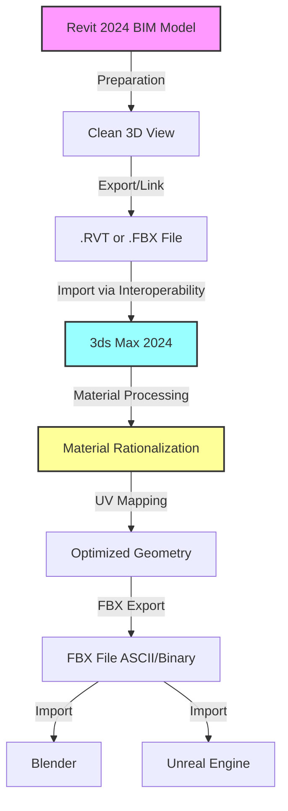
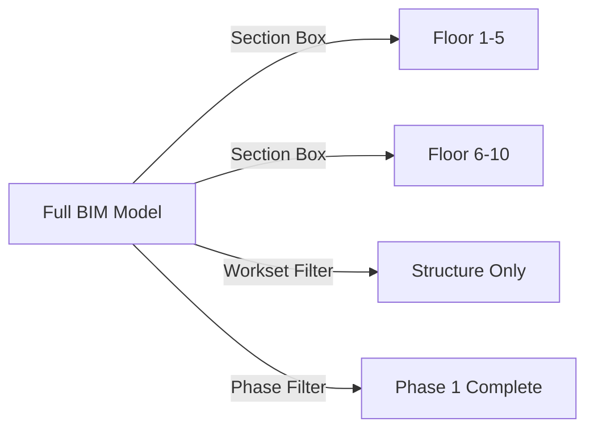
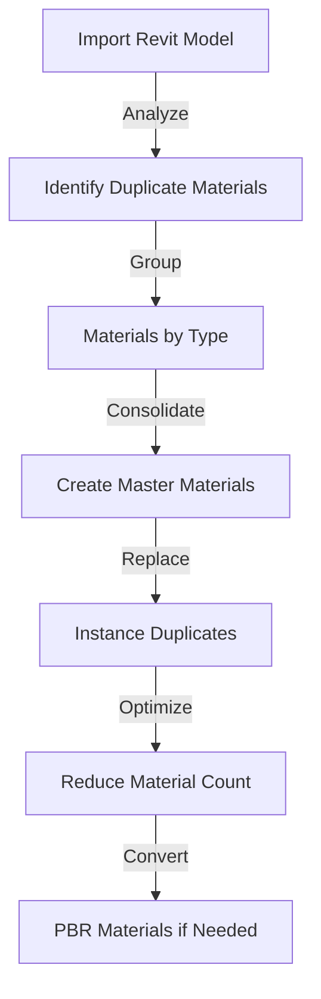
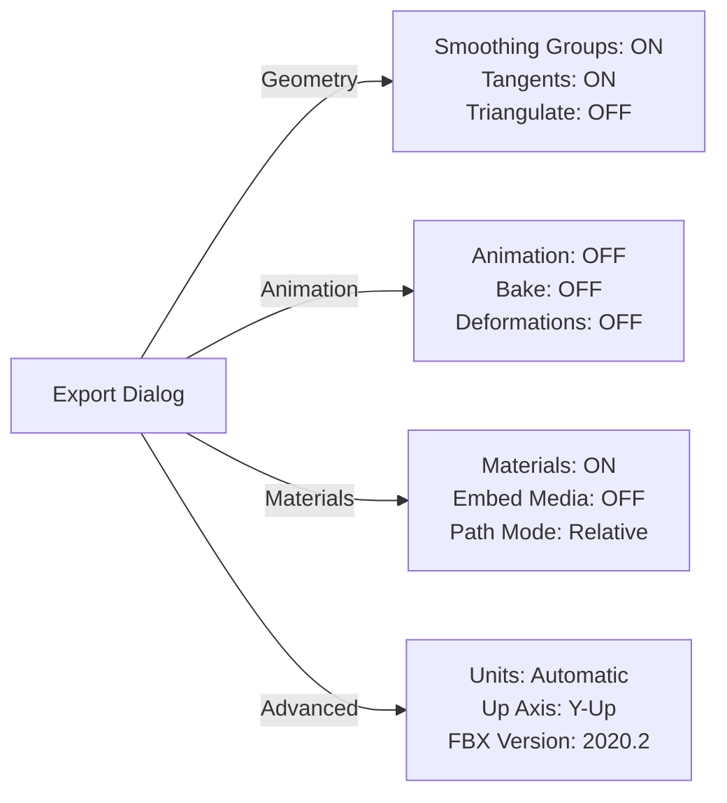
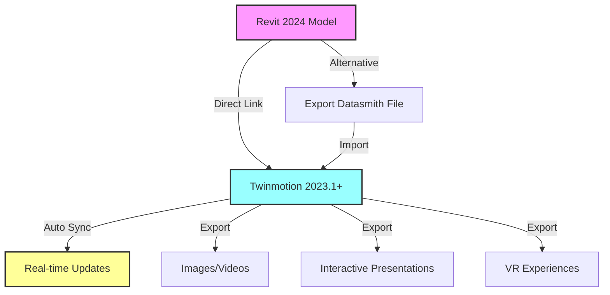
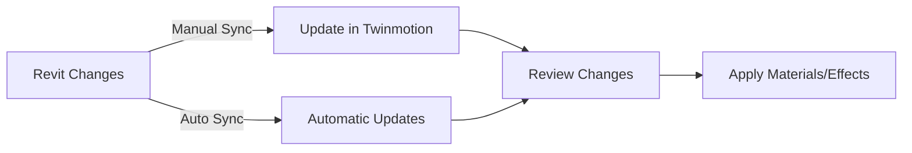
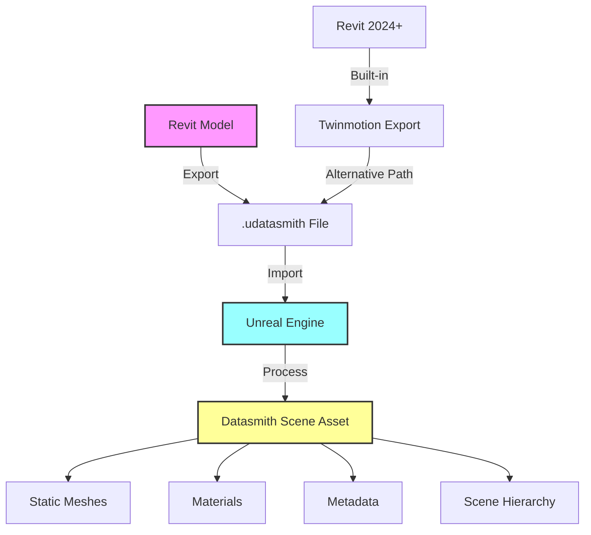
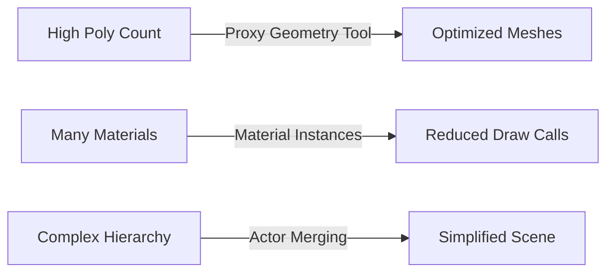

# Revit 2024 to 3ds Max to FBX Technical Workflow Guide

## Executive Summary

This document provides a comprehensive technical workflow for transferring BIM models from Revit 2024 to 3ds Max, then exporting to FBX format for use in Blender and Unreal Engine. **Critical Update**: Autodesk Live Connector was discontinued in March 2020. The current workflow uses **Revit Interoperability for 3ds Max 2024** for file linking, not live connectivity.

## Table of Contents
1. [Current Workflow Architecture](#current-workflow-architecture)
2. [System Requirements & Setup](#system-requirements--setup)
3. [Revit Preparation](#revit-preparation)
4. [3ds Max Import Process](#3ds-max-import-process)
5. [Material Rationalization in 3ds Max](#material-rationalization-in-3ds-max)
6. [FBX Export Configuration](#fbx-export-configuration)
7. [Troubleshooting Common Issues](#troubleshooting-common-issues)
8. [Automation Scripts](#automation-scripts)

## Current Workflow Architecture



## System Requirements & Setup

### Prerequisites
- **3ds Max 2024**: Subscription required ($235/month or $1,875/year)
- **Internet Connection**: Required for on-demand Revit Interoperability installation
- **System**: Windows 10 or higher

### Installing Revit Interoperability

The interoperability module installs automatically when first importing a Revit file:

1. Open 3ds Max 2024
2. Go to `File > Import`
3. Select a `.rvt` file
4. System prompts for installation - click "Install"
5. Wait for completion and restart 3ds Max

**Installation Path**: `C:\Program Files\Common Files\Autodesk Shared\Revit Interoperability 2024`

### Official Documentation Links
- [3ds Max 2024 Revit Interoperability Help](https://help.autodesk.com/view/3DSMAX/2024/ENU/?guid=GUID-E5673D98-5C83-4DAE-A7DB-1673D62FC9B8)
- [Revit to 3ds Max Workflow Guide](https://help.autodesk.com/view/3DSMAX/2024/ENU/?guid=GUID-016004F1-A845-4D7F-99FC-950CAE9B385D)
- [On-Demand Installation Guide](https://help.autodesk.com/cloudhelp/2024/ENU/3DSMax-Interoperability/files/GUID-1483037D-6D97-4383-840C-BE367E619402.htm)

## Revit Preparation

### Model Cleanup Checklist
- [ ] Remove annotations and dimensions
- [ ] Delete hidden geometry
- [ ] Purge unused families and elements
- [ ] Create dedicated 3D view for export
- [ ] Set view detail level appropriately
- [ ] Verify material assignments

### Handling Partial BIM Models

For incomplete building data:
1. Use **Section Boxes** to isolate export areas
2. Organize with **Worksets** for selective export
3. Create **Phase-based** views for partial exports
4. Use **View Templates** to control visibility



## 3ds Max Import Process

### Import Configuration

```maxscript
-- Set system units before import
units.SystemType = #Meters
units.DisplayType = #Metric

-- Import settings
importFile "path/to/model.rvt" #noPrompt using:RVTIMP
```

### File Link Settings (Recommended for Iterative Workflow)
- **Derive Objects By**: Layer, Category, or Family
- **Create Helper at Origin**: Yes (for transform management)
- **Include Levels**: Select specific levels only
- **Combine by Material**: NO (causes geometry shifting)

## Material Rationalization in 3ds Max

This section is designed for users unfamiliar with 3ds Max, providing step-by-step material consolidation procedures.

### Understanding the Material Editor

3ds Max offers two material editor interfaces:

1. **Compact Material Editor**: Simple grid interface for basic operations
2. **Slate Material Editor**: Node-based editor for complex material trees

**Opening the Material Editor**: Press `M` or go to `Rendering > Material Editor`

### Material Consolidation Workflow



### Step-by-Step Material Rationalization

#### 1. Identify Duplicate Materials

Open the **Slate Material Editor** and use the **Material/Map Browser**:
- Click `View > Open Material/Map Browser`
- Select `Scene Materials` to see all materials
- Sort by name to identify duplicates (e.g., "Concrete_01", "Concrete_02")

#### 2. Manual Consolidation Process

For users new to 3ds Max:

1. **Select Objects with Same Material**:
   ```
   Edit > Select By > Material
   ```

2. **Create Material Instance**:
   - Right-click material in editor
   - Choose "Make Unique"
   - Drag to other material slots while holding Shift (creates instance)

3. **Replace Duplicates**:
   - Select objects with duplicate material
   - Apply master material instance
   - Delete unused materials

#### 3. Automated Material Consolidation Script

```maxscript
-- Material Consolidation Tool for Revit Imports
-- Finds and consolidates materials with identical names

macroscript ConsolidateRevitMaterials category:"RevitTools" (
    local matDict = Dictionary()
    local consolidatedCount = 0
    
    -- Collect all scene materials
    for obj in objects where obj.material != undefined do (
        local mat = obj.material
        local matName = mat.name
        
        -- Check if material name exists in dictionary
        if matDict.ContainsKey matName then (
            -- Replace with existing material
            obj.material = matDict[matName]
            consolidatedCount += 1
        ) else (
            -- Add as new master material
            matDict[matName] = mat
        )
    )
    
    format "Consolidated % duplicate materials\n" consolidatedCount
)
```

### Material Optimization Strategies

#### Multi-Sub Material Creation

For efficient material management:

```maxscript
-- Convert multiple materials to Multi-Sub
fn createMultiSubFromSelection = (
    local mats = #()
    local multiMat = Multimaterial()
    
    -- Collect unique materials
    for obj in selection do (
        if obj.material != undefined then
            appendIfUnique mats obj.material
    )
    
    -- Build Multi-Sub material
    multiMat.numsubs = mats.count
    for i = 1 to mats.count do
        multiMat[i] = mats[i]
    
    -- Apply to selection
    for obj in selection do
        obj.material = multiMat
    
    multiMat
)
```

### PBR Material Conversion

For modern rendering pipelines:

```maxscript
-- Convert Revit materials to Physical Materials (PBR)
fn convertToPhysicalMaterial oldMat = (
    local pbr = PhysicalMaterial()
    pbr.name = oldMat.name + "_PBR"
    
    -- Transfer basic properties
    if classof oldMat == StandardMaterial then (
        pbr.base_color = oldMat.diffuse
        pbr.base_color_map = oldMat.diffuseMap
        pbr.roughness = 1.0 - (oldMat.glossiness / 100.0)
        pbr.metalness = if oldMat.specular.r > 200 then 1.0 else 0.0
    )
    
    pbr
)
```

## FBX Export Configuration

### Optimal Export Settings



### MAXScript Export Automation

```maxscript
-- Configure FBX export settings
FBXExporterSetParam "Animation" false
FBXExporterSetParam "Cameras" false
FBXExporterSetParam "Lights" false
FBXExporterSetParam "EmbedTextures" false
FBXExporterSetParam "UpAxis" "Y"
FBXExporterSetParam "FileFormat" "ASCII"  -- Non-binary as requested
FBXExporterSetParam "FileVersion" "FBX202020"
FBXExporterSetParam "ScaleFactor" 1.0
FBXExporterSetParam "ConvertUnit" "cm"

-- Export selected objects
exportFile "C:/Export/building_model.fbx" #noPrompt selectedOnly:true using:FBXEXP
```

### Critical Export Settings for Requirements

1. **Maintain Source Units**: Set `ScaleFactor` to 1.0 and use Automatic units
2. **No Animation Data**: Disable all animation-related options
3. **Non-Binary Format**: Use ASCII format for version control
4. **External Assets**: Disable `EmbedTextures`, use relative paths

## Troubleshooting Common Issues

### Issue: Scale Problems (10x size difference)

**Solution**:
```maxscript
-- Apply Reset XForm before export
for obj in selection do (
    ResetXForm obj
    ConvertTo obj Editable_Poly
)
```

### Issue: Material Loss During Export

**Causes**:
- Revit PBR materials don't translate directly
- Bitmap paths become invalid
- Multi-material ID conflicts

**Solution Workflow**:
1. Convert to Standard or Physical Materials in 3ds Max
2. Use relative texture paths
3. Consolidate materials before export

### Issue: Geometry Shifting

**Prevention**:
- Never use "Combine by Material" when linking
- Export separate FBX files per Revit link
- Maintain consistent pivot points

### Issue: Over-Tessellated Curves

**Optimization Script**:
```maxscript
-- Reduce polygon count on curved objects
for obj in selection do (
    addModifier obj (Optimize())
    obj.modifiers[#Optimize].facethreshold = 4.0
    obj.modifiers[#Optimize].autoEdge = true
)
```

## Automation Scripts

### Complete Pipeline Automation

```maxscript
-- Revit to FBX Pipeline Automation
-- Place in 3ds Max Scripts folder

global RevitFBXPipeline
struct RevitFBXPipeline (
    fn processRevitImport = (
        -- Step 1: Set units
        units.SystemType = #Meters
        units.DisplayType = #Metric
        
        -- Step 2: Consolidate materials
        ConsolidateRevitMaterials()
        
        -- Step 3: Optimize geometry
        for obj in objects do (
            if superclassof obj == GeometryClass then (
                ResetXForm obj
                ConvertTo obj Editable_Poly
            )
        )
        
        -- Step 4: Configure FBX settings
        FBXExporterSetParam "Animation" false
        FBXExporterSetParam "FileFormat" "ASCII"
        FBXExporterSetParam "EmbedTextures" false
        
        -- Step 5: Export
        local exportPath = getSaveFileName caption:"Save FBX" types:"FBX Files (*.fbx)|*.fbx"
        if exportPath != undefined then
            exportFile exportPath #noPrompt using:FBXEXP
    )
)

-- Create instance
RevitFBXPipeline = RevitFBXPipeline()
```

### Material Library Generator

```maxscript
-- Generate material library from Revit import
fn createRevitMaterialLibrary = (
    local libPath = getSavePath caption:"Save Material Library"
    if libPath != undefined then (
        local matLib = MaterialLibrary()
        
        -- Collect all unique materials
        local sceneMats = for m in scenematerials collect m
        
        -- Add to library
        for mat in sceneMats do
            append matLib mat
        
        -- Save library
        saveMaterialLibrary matLib (libPath + "/RevitMaterials.mat")
    )
)
```

## Best Practices Summary

1. **Always use 3ds Max as intermediary** - Direct Revit to FBX export loses materials and has geometry issues
2. **Consolidate materials aggressively** - Reduce material count for better performance
3. **Test export settings** - Verify in both Blender and Unreal before production use
4. **Maintain consistent units** - Set system units in all applications
5. **Use scripts for repetitive tasks** - Automate material consolidation and export settings
6. **Document your pipeline** - Create standard operating procedures for team consistency

## Additional Resources

- [Autodesk Area Forums - Revit Interoperability](https://forums.autodesk.com/t5/3ds-max-forum/bd-p/area-b201)
- [ScriptSpot - 3ds Max Scripts](https://www.scriptspot.com/)
- [CGarchitect - Professional Workflows](https://www.cgarchitect.com/)
- [Polycount Wiki - Game Asset Pipeline](http://wiki.polycount.com/)

## Third-Party Solutions

For teams requiring true live synchronization:
- **Lumion LiveSync**: Real-time connection for visualization
- **Twinmotion Direct Link**: Live connection with Revit
- **Unreal Engine Datasmith**: Direct Revit import (bypasses 3ds Max)
- **D5 Render Sync**: Real-time synchronization option

## Twinmotion Direct Link Workflow

### Overview

Twinmotion for Revit is now included as part of Revit subscriptions, with the Direct Link functionality built directly into Revit 2024. This provides a seamless real-time connection between Revit and Twinmotion without requiring separate plugin installation.

### Workflow Architecture



### Setting Up Direct Link (Revit 2024)

There is no need to install the Datasmith plugin on Revit 2024. The functionality is built-in:

1. **Initial Setup**:
   ```
   View > Twinmotion > Open in Twinmotion
   ```
   - Select "New Project" for first-time setup
   - Twinmotion launches automatically with direct link established

2. **Synchronization**:
   ```
   View > Twinmotion > Direct Link Synchronize
   ```
   - Updates the Twinmotion project file direct link with all recent changes from the Revit model, based on the active Revit 3D view

3. **Export Options**:
   ```
   View > Twinmotion > Export
   View > Twinmotion > Export Settings
   View > Twinmotion > Export Messages
   ```

### Compatibility Matrix

The version of Unreal Datasmith plugin installed is what determines the compatibility between versions of Revit and Twinmotion:

| Revit Version | Twinmotion Version | Datasmith Version | Plugin Type |
|---------------|-------------------|-------------------|-------------|
| 2024+ | 2023.1+ | Built-in | Integrated |
| 2023 | 2022.2.3 - 2023.1 | UE 5.1.1 | Plugin |
| 2022 | 2021.1.4 - 2022.2.3 | UE 5.0.3 | Plugin |
| 2021 | 2021.1.4 | UE 4.27.2 | Plugin |

### Best Practices for Twinmotion Workflow

#### 1. View Preparation
- Create dedicated 3D views for visualization
- The filename of the scene from your design application appears in the Direct Link settings source field
- Use Section Boxes to control export scope
- Manage visibility settings before synchronization

#### 2. Material Handling
- Twinmotion preserves Revit material names and basic properties
- Twinmotion doesn't support default materials of Revit 2024 - assign custom materials
- Use Twinmotion's material library for enhanced realism
- PBR materials can be applied post-import

#### 3. Synchronization Management


#### 4. Texture Management
A folder named DirectLinkTextures is created on your computer. The textures from the scene in your design application are exported and saved in this folder:
- Default location: `Users\[username]\Documents\Twinmotion[version]`
- Can be relocated via Preferences > Settings > Direct Link
- Maintains texture references for consistency

### Troubleshooting Common Issues

#### Issue: "Twinmotion not installed" Error
I had to uninstall and reinstall both, Revit and Twinmotion. It's working now

**Solutions**:
1. Ensure Twinmotion 2023.1+ is installed
2. Launch Twinmotion manually once before using Direct Link
3. Check Windows Task Manager for lingering Revit processes
4. Verify graphics card compatibility

#### Issue: Direct Link Not Updating
Make sure Twinmotion is pointing to the source file. To do this, click the ellipsis (...) above the file in the dock, and in the menu, select Direct Link settings

**Solutions**:
1. Verify source file path in Direct Link settings
2. Use manual synchronization if Auto Sync fails
3. Check for file naming conflicts
4. Ensure both applications are running

## Unreal Engine Datasmith Workflow

### Overview

Datasmith provides a more robust pipeline for bringing Revit models directly into Unreal Engine, preserving metadata, materials, and hierarchy. This workflow is ideal for projects requiring:
- Advanced material customization
- Blueprint-based interactions
- High-fidelity architectural visualization
- Integration with other Unreal Engine features

### Workflow Architecture



### Installation and Setup

#### For Revit 2023 and Earlier
1. Download Datasmith Exporter from [Unreal Engine Datasmith Plugins](https://www.unrealengine.com/en-US/datasmith/plugins)
2. Exit your content creation software, and run the installer file to install the exporter plugin
3. Match plugin version to Unreal Engine version

#### For Revit 2024+
- For Revit 2024+ functionality is built-in via Twinmotion integration
- Use Twinmotion ribbon for Datasmith export

### Export Process

#### 1. View Preparation
You always need to have a 3D View selected and active in Revit in order to export your scene using the Datasmith Exporter plugin

**Best Practices**:
- Create dedicated export views
- Use Section Boxes for selective export
- Apply Visibility/Graphics Overrides
- Hide non-geometric elements

#### 2. Export Settings
```
Datasmith Ribbon > Export 3D View
```

**Options**:
- Tessellation Level: 8 (default, matches FBX export quality)
- Include Linked Models: Yes (if needed)
- Metadata Export: Configure categories

#### 3. Metadata Configuration
Use the Add Group and Remove Selected buttons to add or remove metadata that you want to be included with the exported Datasmith scene

**Important**: The metadata categories are defined by Revit and cannot be changed

### Material Translation

#### Supported Material Properties
Datasmith currently supports translating diffuse maps and colors, Transparency, Cutouts, and Bump settings from Revit into the Unreal Engine Materials

**Material Conversion Table**:
| Revit Property | Unreal Engine Equivalent |
|----------------|-------------------------|
| Diffuse Color | Base Color |
| Diffuse Map | Base Color Texture |
| Transparency | Opacity |
| Cutout | Opacity Mask |
| Bump | Normal Map |
| Scale (Real-world) | Texture Coordinate Scale |

**Limitations**:
- Datasmith does not convert procedural textures, such as Checker, Noise, Tiles, and so on
- Complex material graphs require manual recreation

### Scene Organization

The Datasmith Exporter plugin creates a hierarchy of parent and child Actors in the Datasmith Scene that is intended to reflect the overall organization of your scene in Revit

**Hierarchy Structure**:
```
Datasmith Scene Actor
├── Level: Ground Floor
│   ├── Category: Walls
│   ├── Category: Doors
│   └── Category: Furniture
├── Level: Level 1
│   ├── Category: Walls
│   └── Category: Windows
└── Linked Models
    └── MEP Systems
```

### Metadata Preservation

Datasmith imports metadata about your Revit objects, and attaches that metadata to the Actor that represents each Revit object inside the Unreal Engine

**Accessing Metadata in Blueprints**:
```blueprint
Get Datasmith User Data
├── Object Name
├── Element ID
├── Type Properties
└── Instance Properties
```

### Optimization Strategies

#### 1. Geometry Optimization
- Use Revit's visibility settings to exclude unnecessary geometry
- Note that when an object crosses the boundaries of the Section Box, such as the walls, floor and furniture in the images below, its geometry is truncated
- Leverage instancing for repeated elements

#### 2. Material Consolidation
- Group similar materials in Revit before export
- Use Unreal's material instance system
- Create material parameter collections for global adjustments

#### 3. Performance Considerations


### Advanced Workflows

#### 1. Batch Export via Dynamo
Alternatively, you can use Dynamo to batch export Revit views

**Dynamo Script Structure**:
1. Collect all 3D views
2. Filter by naming convention
3. Set active view
4. Export via Datasmith API
5. Log results

#### 2. Blueprint Automation
Create blueprints for:
- Material switching based on metadata
- Level-of-detail systems
- Interactive elements using BIM data
- Automated scene setup

#### 3. Version Control Integration
- Store .udatasmith files in version control
- Track changes between exports
- Maintain export logs for team coordination

### Troubleshooting

#### Issue: Missing Geometry
**Causes**:
- Hidden elements in Revit view
- Section box clipping
- Unsupported element types

**Solutions**:
1. Review 3D view visibility settings
2. Check section box boundaries
3. Verify element categories are supported

#### Issue: Material Mismatches
The problem lies in the Revit to Maya export and conversion step, where the translation of Revit geometry to polygonal mesh is done

**Solutions**:
1. Use supported material properties only
2. Manually recreate complex materials
3. Leverage Unreal's material editor capabilities

#### Issue: Performance Problems
**Optimization Checklist**:
- [ ] Enable Nanite for high-poly meshes
- [ ] Use LODs for distant objects
- [ ] Implement occlusion culling
- [ ] Optimize material complexity
- [ ] Consider HLOD systems

### Comparison: Twinmotion vs Datasmith

| Feature | Twinmotion | Datasmith (Unreal) |
|---------|------------|-------------------|
| **Setup Complexity** | Simple | Moderate to Complex |
| **Real-time Sync** | Yes (Direct Link) | No (File-based) |
| **Material Quality** | Good | Excellent (Full PBR) |
| **Customization** | Limited | Extensive |
| **Learning Curve** | Low | High |
| **Metadata Access** | Basic | Full |
| **Output Options** | Images, Videos, VR | Everything + Games |
| **Performance** | Optimized | Requires Optimization |
| **Cost** | Included with Revit | Separate License |

### Choosing the Right Workflow

**Use Twinmotion when**:
- Quick visualization is needed
- Non-technical users are involved
- Standard materials are sufficient
- Real-time collaboration is important

**Use Datasmith/Unreal when**:
- Maximum visual quality is required
- Custom interactions are needed
- Metadata-driven features are important
- Integration with other systems is planned
- Advanced rendering features are required

---

*Document Version: 2.0 | Last Updated: July 2025*
